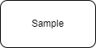
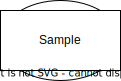

# Sample documentation

_work in progress_

## Current versions

List of current components versions

[%header,format=dsv]
:===
Component:Version
racelogger: v0.6.2
iracelog: v0.18.3
:===

List of current components versions (include)

[%header,format=csv]
,===
include::versions.csv[]
,===

List of current components versions (include,inline)

[%header,format=csv,opts=inline]
,===
include::versions.csv[]
,===

Sample graph png

Sample drawio svg

Sample drawio 

image::sample2.drawio[format=svg]